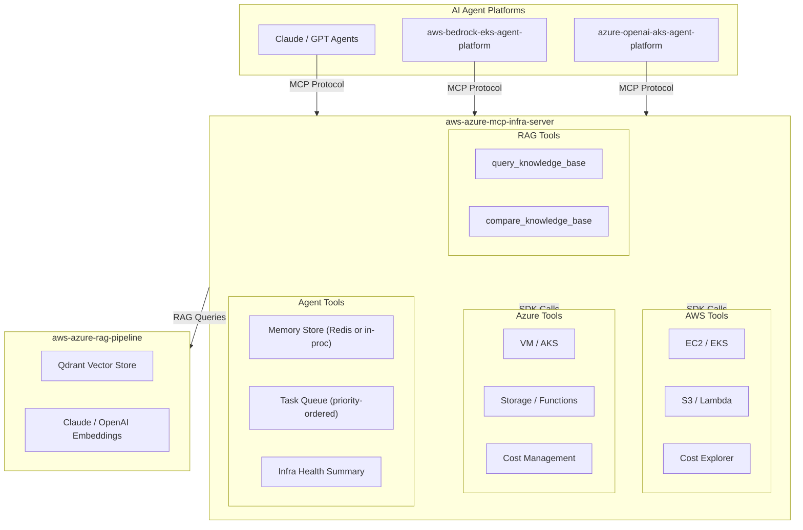

# aws-azure-mcp-infra-server

`https://img.shields.io/badge/Python-3.10+-blue`
`https://img.shields.io/badge/Docker-Ready-blue`
`https://img.shields.io/badge/CI-GitHub_Actions-green`
`https://img.shields.io/badge/License-MIT-yellow`
`https://img.shields.io/badge/MCP-Server-orange`

An [MCP (Model Context Protocol)](https://modelcontextprotocol.io) server that bridges **multi-cloud infrastructure** with **AI agent context management** and a **RAG-powered knowledge base**.

Designed to complement AI agent platforms running on **EKS** and **AKS** — agents can query live infrastructure state, track costs, maintain persistent memory, and retrieve grounded answers from an infrastructure knowledge base powered by **Claude** or **OpenAI**.

📐 See [ARCHITECTURE.md](./ARCHITECTURE.md) for the full three-layer stack design, data flow, and local setup guide.

---

## Why This Exists

AI agents are powerful, but without real infrastructure context they are:

- **Blind** to cloud resources  
- **Unreliable** when asked about IaC or runbooks  
- **Unsafe** when taking infrastructure actions  
- **Fragmented** across AWS and Azure  

Enterprises need agents that are:

- **Grounded** in real Terraform, docs, and code  
- **Aware** of live AWS + Azure state  
- **Deterministic** and auditable  
- **Unified** across multi-cloud environments  

`aws-azure-mcp-infra-server` solves this by giving agents:

- A **single multi-cloud control plane**  
- A **RAG-powered knowledge base** grounded in your repos  
- A **memory + task system** for long-term reasoning  
- A **safe, structured interface** to cloud operations  

This transforms agents from “chatbots” into **reliable infrastructure copilots**.

---

## Architecture (Mermaid)



---

## Architecture (ASCII)

```
┌─────────────────────────────────────────────────────────┐
│              AI Agent (Claude / GPT)                    │
│       (aws-bedrock-eks-agent-platform)                  │
│       (azure-openai-aks-agent-platform)                 │
└──────────────────────────┬──────────────────────────────┘
                           │ MCP Protocol
                           ▼
┌─────────────────────────────────────────────────────────┐
│              aws-azure-mcp-infra-server                 │
│                                                         │
│  ┌──────────────────┐  ┌──────────────────────────┐    │
│  │  AWS Tools       │  │  Azure Tools             │    │
│  │  · EC2 / EKS     │  │  · VM / AKS              │    │
│  │  · S3 / Lambda   │  │  · Storage / Functions   │    │
│  │  · Cost Explorer │  │  · Cost Management       │    │
│  └──────────────────┘  └──────────────────────────┘    │
│                                                         │
│  ┌──────────────────────────────────────────────────┐   │
│  │  Agent Tools                                     │   │
│  │  · Memory store  (in-proc or Redis)              │   │
│  │  · Task queue    (priority-ordered)              │   │
│  │  · Health summary (aggregated, multi-cloud)      │   │
│  └──────────────────────────────────────────────────┘   │
│                                                         │
│  ┌──────────────────────────────────────────────────┐   │
│  │  RAG Tools (NEW)                                 │   │
│  │  · query_knowledge_base  → Claude or OpenAI      │   │
│  │  · compare_knowledge_base → both in parallel     │   │
│  └──────────────────────────────────────────────────┘   │
└───────────┬───────────────────────┬─────────────────────┘
            │                       │
     ┌──────▼──────┐      ┌─────────▼──────────────┐
     │  AWS/Azure  │      │  aws-azure-rag-pipeline │
     │  boto3/SDK  │      │  (Qdrant + Claude/GPT)  │
     └─────────────┘      └─────────────────────────┘
```

---

## Tools

| Tool | Description |
|------|-------------|
| `get_aws_resources` | List EC2, EKS, S3, Lambda resources by region |
| `get_aws_costs` | Cost Explorer data grouped by service/region |
| `get_azure_resources` | List VMs, AKS clusters, storage, function apps |
| `get_azure_costs` | Azure Cost Management grouped by service/RG |
| `store_agent_memory` | Persist key-value context for an agent |
| `get_agent_memory` | Retrieve stored agent context |
| `add_agent_task` | Enqueue a prioritized task for an agent |
| `get_agent_tasks` | Retrieve task queue (filterable by status) |
| `complete_agent_task` | Mark a task done with optional result |
| `get_infra_health_summary` | Aggregated health across AWS + Azure |
| `query_knowledge_base` | RAG query against infrastructure docs and code |
| `compare_knowledge_base` | Same RAG query answered by Claude + OpenAI |

---

## How Agents Use This

### 1. Querying live infrastructure

```json
{
  "name": "get_aws_resources",
  "arguments": {
    "service": "eks",
    "region": "us-east-1"
  }
}
```

---

### 2. Retrieving grounded RAG answers

```json
{
  "name": "query_knowledge_base",
  "arguments": {
    "query": "AKS node pool autoscaling configuration",
    "provider": "claude"
  }
}
```

---

### 3. Comparing Claude vs GPT interpretations

```json
{
  "name": "compare_knowledge_base",
  "arguments": {
    "query": "EKS ↔ AKS cross-cloud networking architecture"
  }
}
```

---

### 4. Persisting long-term agent memory

```json
{
  "name": "store_agent_memory",
  "arguments": {
    "agent_id": "infra-agent",
    "key": "aks_prod_nodepool",
    "value": "np-prod-01"
  }
}
```

---

### 5. Adding tasks to the agent’s queue

```json
{
  "name": "add_agent_task",
  "arguments": {
    "agent_id": "infra-agent",
    "task": "check_aws_cost_anomalies",
    "priority": "high"
  }
}
```

---

## RAG Integration

The RAG tools connect to the  
**[aws-azure-rag-pipeline](https://github.com/joshphillis/aws-azure-rag-pipeline)**,  
which indexes:

- Terraform modules  
- Infrastructure documentation  
- Runbooks  
- AWS + Azure code repositories  

Agents receive **grounded, cited answers** before taking infrastructure actions.

Set the pipeline URL:

```bash
RAG_PIPELINE_URL=http://host.docker.internal:8000
RAG_PIPELINE_URL=http://rag-pipeline-service:8000
```

---

## Quickstart

### 1. Clone and configure

```bash
git clone https://github.com/joshphillis/aws-azure-mcp-infra-server.git
cd aws-azure-mcp-infra-server
cp .env.example .env
```

### 2. Run locally

```bash
docker compose up --build
```

### 3. Test RAG

```bash
curl -X POST http://localhost:8080/tool \
  -H "Content-Type: application/json" \
  -d '{
    "name": "query_knowledge_base",
    "arguments": {
      "query": "How does the EKS node group scale?",
      "provider": "claude"
    }
  }'
```

---

## Configuration

| Variable | Description | Required |
|----------|-------------|----------|
| `AWS_ACCESS_KEY_ID` | AWS access key | No |
| `AWS_SECRET_ACCESS_KEY` | AWS secret key | No |
| `AWS_DEFAULT_REGION` | Default AWS region | No |
| `AZURE_TENANT_ID` | Azure tenant ID | No |
| `AZURE_CLIENT_ID` | Azure service principal client ID | No |
| `AZURE_CLIENT_SECRET` | Azure service principal secret | No |
| `AZURE_SUBSCRIPTION_ID` | Azure subscription ID | Yes |
| `REDIS_URL` | Redis connection URL | No |
| `RAG_PIPELINE_URL` | RAG pipeline URL | No |

> **Use IRSA (EKS) or Workload Identity (AKS) in production.**

---

## Kubernetes Deployment

```bash
cd terraform
terraform init
terraform apply \
  -var="image=ghcr.io/joshphillis/aws-azure-mcp-infra-server:latest" \
  -var="azure_subscription_id=YOUR_SUB_ID" \
  -var="replicas=2"
```

---

## Related Repositories

| Repo | Description |
|------|-------------|
| **aws-azure-rag-pipeline** | Provider-agnostic RAG pipeline |
| **aws-bedrock-eks-agent-platform** | AI agent platform on AWS |
| **azure-openai-aks-agent-platform** | AI agent platform on Azure |
| **aws-secure-agent-platform-terraform** | Secure AWS IaC |
| **azure-openai-secure-agent-platform-terraform** | Secure Azure IaC |
| **agent-platform-cicd** | CI/CD for multi-cloud agent platforms |

---

## License

MIT
